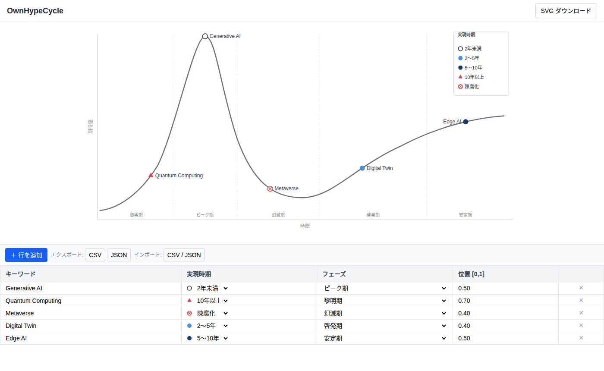

# OwnHypeCycle

**自分だけのガートナー ハイプサイクルを、ブラウザで手軽に作れるツール。**

テーブルにキーワードを入力するだけで、なめらかなハイプサイクル曲線上に自動マッピング。
ドラッグで位置を微調整し、SVG・CSV・JSON でそのまま出力できます。

---



---

## できること

| 機能 | 説明 |
|------|------|
| **リアルタイム描画** | テーブルへの入力と同時にチャートに反映される |
| **ドラッグ操作** | アイコンまたはキーワードラベルをドラッグしてフェーズ内の位置を調整 |
| **ホバーハイライト** | マウスを乗せると操作可能な要素がハイライト表示される |
| **実現時期アイコン** | Gartner スタイルの 5 種の記号で実現時期を表現 |
| **SVG ダウンロード** | チャートをそのまま SVG ファイルとして保存 |
| **CSV / JSON** | テーブルデータのエクスポート・インポートで再利用可能 |
| **コンテナ配布** | Docker 1 コマンドで起動できるよう構成済み |

### ハイプサイクルのフェーズ

| フェーズ | 説明 |
|---------|------|
| 黎明期 | 技術の登場・初期の注目 |
| ピーク期 | 過度な期待が高まる |
| 幻滅期 | 期待が裏切られ関心が低下 |
| 啓発期 | 実用的な価値が認識される |
| 安定期 | 主流として定着 |

### 実現時期の凡例

| 記号 | 意味 |
|------|------|
| ○ 白丸 | 2年未満 |
| ● 青丸 | 2〜5年 |
| ● 紺丸 | 5〜10年 |
| ▲ 赤三角 | 10年以上 |
| ⊗ 赤バツ丸 | 安定期に達する前に陳腐化 |

---

## 技術スタック

| 層 | 技術 |
|----|------|
| フロントエンド | React + Vite + TypeScript |
| スタイル | Tailwind CSS |
| 可視化 | カスタム SVG（外部ライブラリなし） |
| コンテナ | nginx:alpine（マルチステージビルド） |

---

## セットアップ

### 前提条件

- Node.js 20 以上
- npm 9 以上
- Docker（コンテナで動かす場合）

### リポジトリのクローン

```bash
git clone https://github.com/corestate55/ownhypecycle.git
cd ownhypecycle
```

---

## 起動方法

### ローカル開発サーバー

```bash
npm install
npm run dev
```

ブラウザで http://localhost:5173 を開く。

### Docker コンテナ

```bash
# イメージをビルド
docker build -t ownhypecycle .

# コンテナを起動
docker run -p 8080:80 ownhypecycle
```

ブラウザで http://localhost:8080 を開く。

ポートを変えたい場合:

```bash
docker run -p 3000:80 ownhypecycle
# → http://localhost:3000
```

### その他のコマンド

```bash
npm run build    # プロダクションビルド（型チェック付き）
npm run preview  # ビルド成果物のローカルプレビュー
```

---

## 使い方

### 1. キーワードを追加する

**「＋ 行を追加」** ボタンをクリックして新しい行を追加します。
キーワード列をクリックして入力すると、1文字ごとにチャートへリアルタイム反映されます。

### 2. フェーズと実現時期を設定する

各行のドロップダウンから「フェーズ」と「実現時期」を選択します。
選択するとすぐにチャート上の表示が変わります。

### 3. チャート上でドラッグして位置を調整する

チャート上のアイコンまたはキーワードラベルにマウスを乗せると **ハイライト** されます。
そのままドラッグすると、フェーズの区間内で自由に位置を動かせます。
テーブルの「位置 [0, 1]」列もリアルタイムで更新されます。

### 4. データを保存・共有する

| 操作 | ボタン | 出力 |
|------|--------|------|
| チャートを画像として保存 | SVG ダウンロード（右上） | `hypecycle.svg` |
| テーブルを CSV で保存 | CSV | `hypecycle.csv` |
| テーブルを JSON で保存 | JSON | `hypecycle.json` |
| 以前のデータを読み込む | CSV / JSON | ファイル選択 |

> **注意**: ページを閉じるとデータは消えます。継続して使う場合は CSV または JSON でエクスポートしてください。

---

## ライセンス

[MIT](LICENSE)
